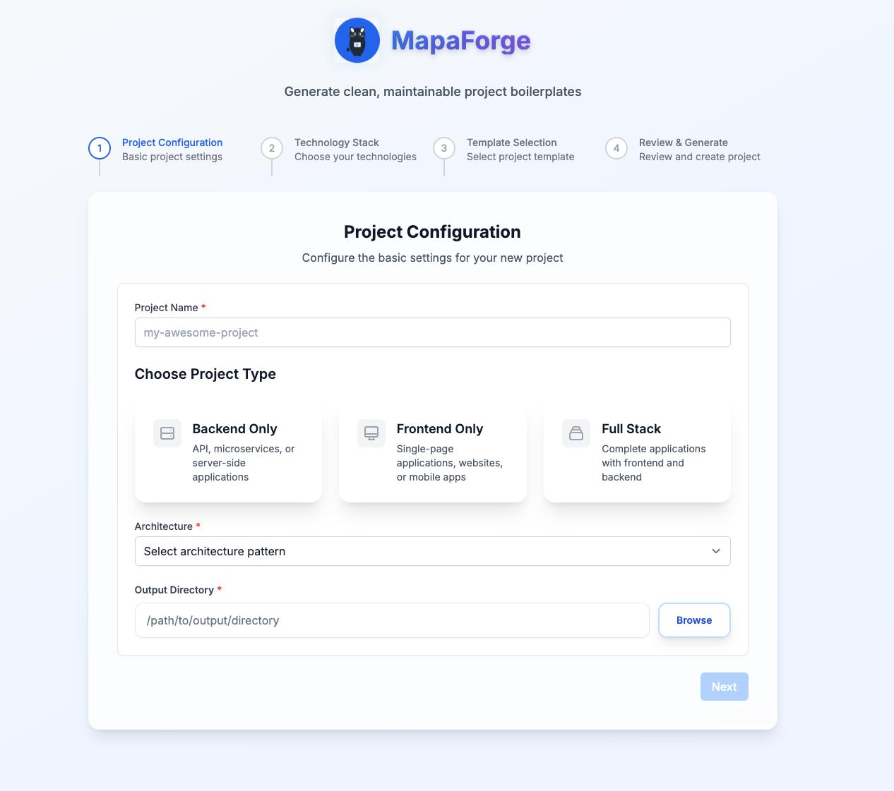

# MapaForge

<div align="center">


**Transform your development workflow with intelligent project scaffolding** 🚀

[](https://github.com/wfernandez/scaffolder-boilerplate-builder/actions/workflows/ci.yml)
[](https://opensource.org/licenses/MIT)
[](https://www.typescriptlang.org/)
[](https://www.electronjs.org/)
[](https://reactjs.org/)

[Getting Started](#getting-started) • [Features](#features) • [Documentation](#documentation) • [Contributing](#contributing)

</div>

---

## Introduction

**MapaForge** is a powerful desktop application that revolutionizes project scaffolding by generating clean, maintainable boilerplates with enterprise-grade architectures. Built with modern development practices and extensible design patterns, it empowers developers to kickstart projects with best practices baked in from day one.

Whether you're building microservices, full-stack applications, or experimenting with new architectures, MapaForge provides the foundation you need to focus on what matters most - your business logic.

### Key Capabilities

🏗️ **Clean Architecture** - Built with SOLID principles and dependency injection  
🎯 **Multiple Project Types** - Backend-only, Frontend-only, and Full-stack projects  
🔧 **Architecture Patterns** - Monolithic, Microservices, Serverless, JAMStack, SPA, SSR  
⚡ **Modern Tech Stacks** - Support for popular frameworks and cutting-edge tools  
🎨 **Pluggable Templates** - Extensible template system with Handlebars, Mustache, and EJS  
🔌 **Plugin Ecosystem** - Modular architecture for custom functionality  
📊 **Real-time Progress** - Live updates and intelligent progress tracking  
🌍 **Cross-platform** - Native support for Windows, macOS, and Linux

## Screenshots

<div align="center">

### MapaForge Interface Overview



_Experience the complete MapaForge workflow from project configuration to real-time generation_

---

**🧙‍♂️ Project Configuration Wizard** - Intuitive step-by-step interface for configuring your project architecture, technology stack, and preferences

**🎨 Template Selection** - Beautiful gallery view to browse and select from a curated collection of project templates with live previews

**⚡ Real-time Generation** - Dynamic progress tracking with detailed logs as your project comes to life in real-time

</div>

## Tech Stack

<div align="center">

| Category              | Technologies                                                                                                                                                                                                                                                                                                                                 |
| --------------------- | -------------------------------------------------------------------------------------------------------------------------------------------------------------------------------------------------------------------------------------------------------------------------------------------------------------------------------------------- |
| **Desktop Framework** |                                                                                                                                                                                                                                   |
| **Frontend**          |    |
| **Backend**           |                                                                                                                   |
| **Architecture**      |                                                                                                                                                             |
| **Testing**           |                                                                                                                              |
| **Development**       |                     |

</div>

## Architecture Overview

MapaForge is built with clean architecture principles, ensuring maintainability, testability, and extensibility.

<details>
<summary><strong>📁 Project Structure</strong></summary>

```
src/
├── main/                          # Electron main process
│   ├── core/                      # Core abstractions and interfaces
│   │   ├── interfaces/            # Service interfaces
│   │   ├── abstractions/          # Base classes
│   │   └── types/                 # Type definitions
│   ├── modules/                   # Business logic modules
│   │   ├── template-engine/       # Template processing
│   │   ├── file-generator/        # File generation logic
│   │   ├── project-config/        # Configuration management
│   │   └── validation/            # Input validation
│   └── infrastructure/            # External concerns
│       ├── electron/              # Electron-specific code
│       ├── file-system/           # File operations
│       └── logging/               # Logging implementation
├── renderer/                      # React frontend
│   ├── components/                # UI components
│   │   ├── atoms/                 # Basic components
│   │   ├── molecules/             # Composite components
│   │   ├── organisms/             # Complex components
│   │   └── templates/             # Page layouts
│   ├── hooks/                     # Custom React hooks
│   ├── contexts/                  # React contexts
│   ├── services/                  # Frontend services
│   └── utils/                     # Utility functions
└── shared/                        # Shared code
    ├── constants/                 # Application constants
    ├── types/                     # Shared type definitions
    └── validators/                # Validation schemas
```

</details>

### Design Principles

<div align="center">

| Principle           | Implementation                                                                                       |
| ------------------- | ---------------------------------------------------------------------------------------------------- |
| **SOLID**           | Single Responsibility, Open/Closed, Liskov Substitution, Interface Segregation, Dependency Inversion |
| **Clean Code**      | DRY, KISS, YAGNI principles with meaningful naming and self-documenting code                         |
| **Design Patterns** | Dependency Injection, Observer, Strategy, Factory, Template Method patterns                          |
| **Testability**     | 80%+ code coverage with unit, integration, and E2E testing strategies                                |

</div>

## Building & Deployment

### Production Build

```bash
# Build both main and renderer processes
npm run build

# Package for distribution (coming soon)
npm run package
```

### Continuous Integration

MapaForge uses GitHub Actions for automated testing and quality assurance:

- ✅ **Automated Testing** - Unit, integration, and E2E tests
- ✅ **Code Quality** - ESLint, Prettier, and TypeScript checks
- ✅ **Security Scanning** - Dependency vulnerability checks
- ✅ **Cross-platform** - Testing on Windows, macOS, and Linux

## Getting Started

### Prerequisites

Before you begin, ensure you have the following installed on your system:

- **Node.js** (v18 or higher) - [Download](https://nodejs.org/)
- **npm** or **yarn** - Package manager
- **Git** - Version control system

### Quick Start

Get up and running with MapaForge in just a few commands:

```bash
# Clone the repository
git clone https://github.com/wfernandez/scaffolder-boilerplate-builder.git
cd scaffolder-boilerplate-builder

# Install dependencies
npm install

# Set up development environment
npm run setup:dev

# Start the application
npm run dev
```

The application will launch automatically, and you'll be guided through creating your first project scaffold.

### Development Setup

For contributors and advanced users who want to modify MapaForge:

1. **Install dependencies and prepare development environment:**

   ```bash
   npm install
   npm run prepare
   ```

2. **Start development servers:**

   ```bash
   # Start both main and renderer processes
   npm run dev

   # Or start them separately
   npm run dev:main    # Electron main process
   npm run dev:renderer # React development server
   ```

3. **Run the test suite:**

   ```bash
   npm test              # Run all tests
   npm run test:watch    # Run tests in watch mode
   npm run test:coverage # Generate coverage report
   npm run test:e2e      # Run end-to-end tests
   ```

4. **Code quality checks:**
   ```bash
   npm run lint          # Check code quality
   npm run lint:fix      # Fix linting issues
   npm run format        # Format code
   npm run typecheck     # Type checking
   ```

## Extensibility

### Plugin Development

MapaForge's plugin system allows you to extend functionality with custom logic:

<details>
<summary><strong>🔌 Creating a Custom Plugin</strong></summary>

```typescript
import { BasePlugin } from "@main/core/abstractions/BasePlugin";
import { ProjectConfig } from "@shared/types";

export class CustomPlugin extends BasePlugin {
  readonly name = "custom-plugin";
  readonly version = "1.0.0";
  readonly description = "Custom functionality for project generation";

  protected async onInit(): Promise<void> {
    // Plugin initialization logic
    this.logger.info("Custom plugin initialized");
  }

  async execute(config: ProjectConfig): Promise<void> {
    // Main plugin logic
    this.logger.info(`Processing project: ${config.name}`);

    // Your custom logic here
    await this.processCustomLogic(config);
  }

  private async processCustomLogic(config: ProjectConfig): Promise<void> {
    // Implementation details
  }

  protected async onCleanup(): Promise<void> {
    // Cleanup logic
    this.logger.info("Custom plugin cleaned up");
  }
}
```

</details>

### Template Development

Create custom project templates with YAML configuration:

<details>
<summary><strong>🎨 Template Structure</strong></summary>

```yaml
# template.yml
name: "My Custom Template"
version: "1.0.0"
description: "A custom project template with modern architecture"
author: "Your Name"
tags: ["react", "typescript", "full-stack"]
supportedTypes: ["full-stack", "frontend"]

files:
  - path: "package.json"
    isTemplate: true
    engine: "handlebars"
  - path: "src/index.ts"
    isTemplate: true
    engine: "mustache"
  - path: "README.md"
    isTemplate: true
    engine: "ejs"

variables:
  - name: "projectName"
    type: "string"
    required: true
    description: "Name of the project"
    validation: "^[a-zA-Z][a-zA-Z0-9-_]*$"

  - name: "author"
    type: "string"
    required: false
    description: "Project author"
    default: "Anonymous"

  - name: "features"
    type: "array"
    required: false
    description: "Additional features to include"
    options: ["testing", "linting", "ci/cd", "docker"]

hooks:
  pre-generate: "./scripts/pre-generate.js"
  post-generate: "./scripts/post-generate.js"
```

</details>

## Documentation

### Quick Links

- 📖 **[User Guide](docs/user-guide.md)** - Complete usage documentation
- 🏗️ **[Architecture Guide](docs/architecture.md)** - Technical architecture details
- 🔌 **[Plugin API](docs/plugin-api.md)** - Plugin development reference
- 🎨 **[Template Guide](docs/template-guide.md)** - Template creation tutorial
- 🧪 **[Testing Guide](docs/testing.md)** - Testing strategies and best practices

### Tutorials

- [Creating Your First Plugin](docs/tutorials/first-plugin.md)
- [Building Custom Templates](docs/tutorials/custom-templates.md)
- [Advanced Configuration](docs/tutorials/advanced-config.md)

## Contributing

We welcome contributions from the community! MapaForge thrives on collaboration and diverse perspectives.

### 🚀 Quick Start for Contributors

1. **Fork the repository** and clone your fork
2. **Create a feature branch**: `git checkout -b feature/amazing-feature`
3. **Install dependencies**: `npm install`
4. **Make your changes** with tests
5. **Run the test suite**: `npm test`
6. **Submit a pull request**

### 📋 Contribution Guidelines

<div align="center">

| Type                 | Description                | Example                                                                                                                  |
| -------------------- | -------------------------- | ------------------------------------------------------------------------------------------------------------------------ |
| 🐛 **Bug Fix**       | Fix existing functionality | [Create Bug Report](https://github.com/wfernandez/scaffolder-boilerplate-builder/issues/new?template=bug_report.md)      |
| ✨ **Feature**       | Add new functionality      | [Feature Request](https://github.com/wfernandez/scaffolder-boilerplate-builder/issues/new?template=feature_request.md)   |
| 📚 **Documentation** | Improve docs               | [Documentation Issue](https://github.com/wfernandez/scaffolder-boilerplate-builder/issues/new?template=documentation.md) |
| 🔧 **Refactor**      | Code improvements          | Performance, readability                                                                                                 |
| 🧪 **Tests**         | Add or improve tests       | Unit, integration, E2E                                                                                                   |

</div>

### Code Standards

- **TypeScript Strict Mode** - Full type safety
- **Function Length** - Maximum 30 lines
- **File Length** - Maximum 300 lines
- **Naming** - Meaningful, descriptive names
- **Documentation** - Self-documenting code with JSDoc comments

### Commit Convention

We use [Conventional Commits](https://www.conventionalcommits.org/) for semantic versioning:

```bash
feat(ui): add dark theme support
fix(generator): resolve template parsing error
docs: update installation instructions
test(core): add validation unit tests
refactor(plugin): improve error handling
```

### Pull Request Process

1. **Fork & Branch** - Create feature branch from `main`
2. **Develop** - Implement changes with appropriate tests
3. **Test** - Ensure all tests pass (`npm test`)
4. **Document** - Update relevant documentation
5. **Review** - Submit PR for community review

Not sure where to start? Join our [Discord community](https://discord.gg/mapaforge) and we'll help you find the perfect first contribution!

## Resources

### Community & Support

<div align="center">

| Resource             | Description                         | Link                                                                                 |
| -------------------- | ----------------------------------- | ------------------------------------------------------------------------------------ |
| 📖 **Documentation** | Complete project documentation      | [docs/](docs/)                                                                       |
| 💬 **Discord**       | Community discussions and support   | [Join Discord](https://discord.gg/mapaforge)                                         |
| 🐛 **Issues**        | Bug reports and feature requests    | [GitHub Issues](https://github.com/wfernandez/scaffolder-boilerplate-builder/issues) |
| 📧 **Email**         | Direct contact for sensitive issues | [contact@mapaforge.dev](mailto:contact@mapaforge.dev)                                |
| 🐦 **Twitter**       | Latest updates and announcements    | [@MapaForge](https://twitter.com/mapaforge)                                          |

</div>

### Learning Resources

- **[Clean Architecture Guide](https://blog.cleancoder.com/uncle-bob/2012/08/13/the-clean-architecture.html)** - Understanding the architectural principles
- **[Electron Documentation](https://www.electronjs.org/docs)** - Desktop app development
- **[React Best Practices](https://react.dev/)** - Modern React development
- **[TypeScript Handbook](https://www.typescriptlang.org/docs/)** - Type-safe JavaScript

## Contributors

<div align="center">

We're grateful to all the amazing people who have contributed to MapaForge! 🙏

[](https://github.com/wfernandez/scaffolder-boilerplate-builder/graphs/contributors)

_Want to see your avatar here? [Contribute to MapaForge!](#contributing)_

</div>

## License

This project is licensed under the **MIT License** - see the [LICENSE](LICENSE) file for details.

---

<div align="center">

**⭐ Star this repository if MapaForge helps you build better projects!**

[⬆ Back to Top](#mapaforge)

</div>
